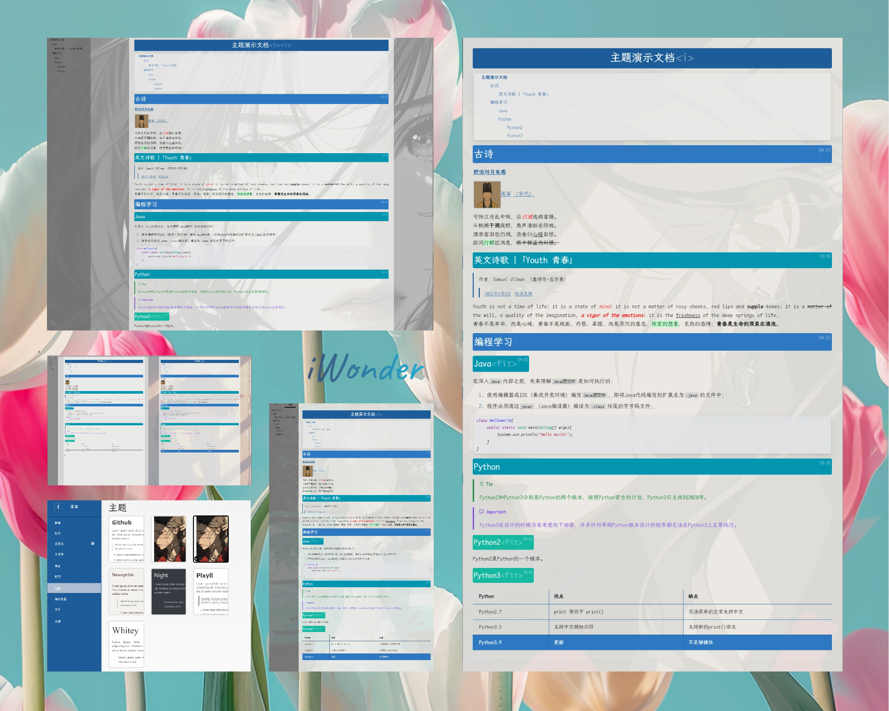
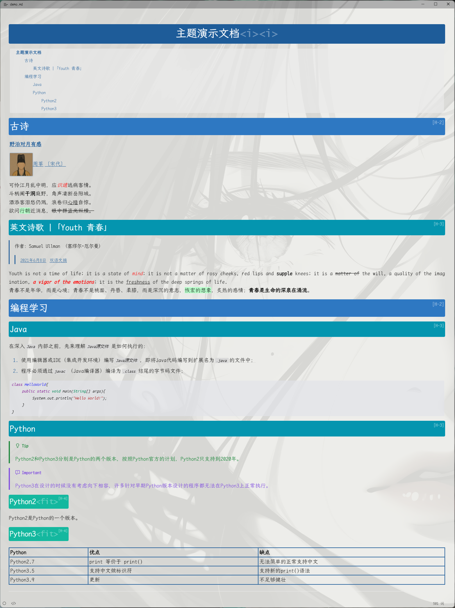
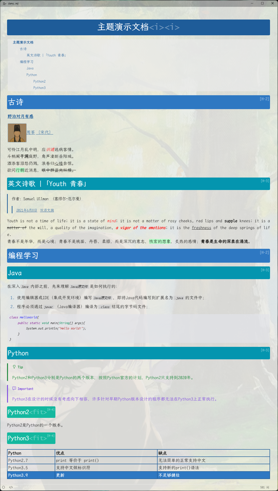
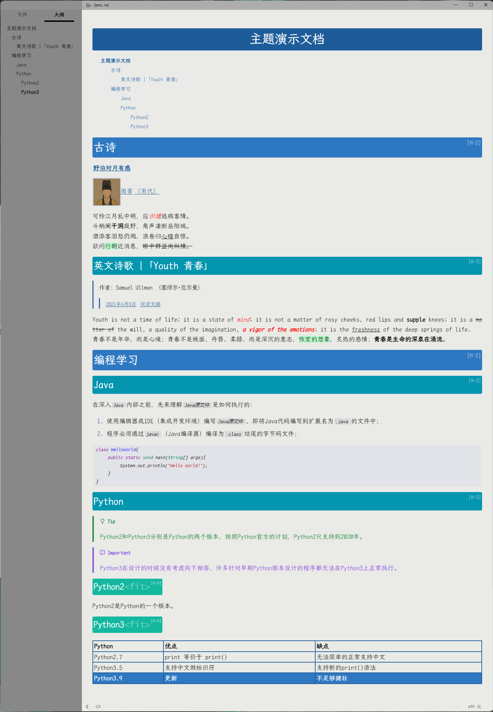
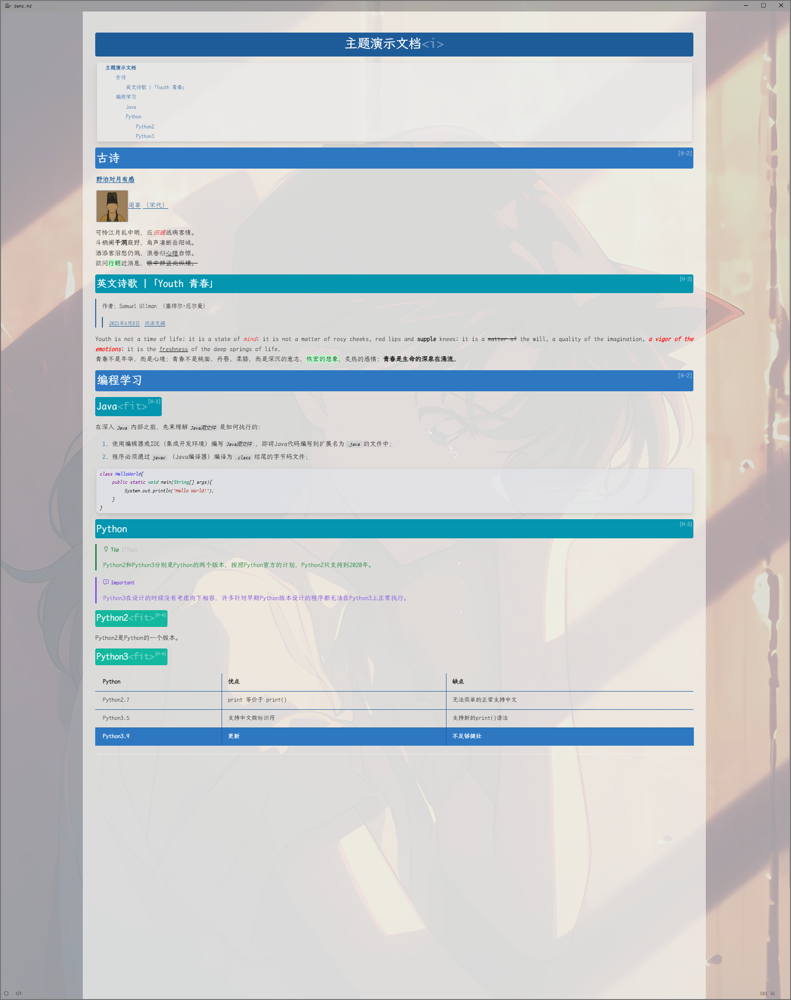
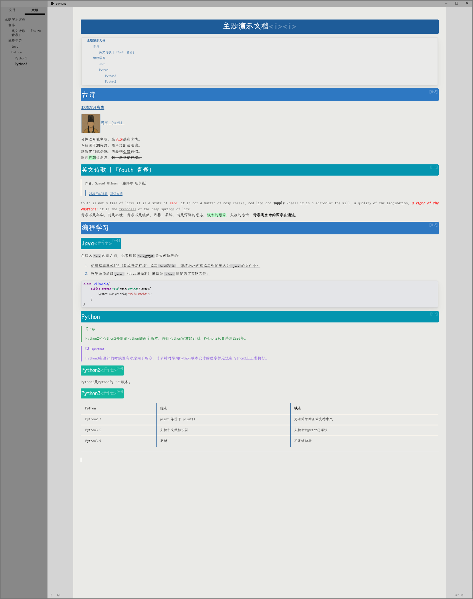
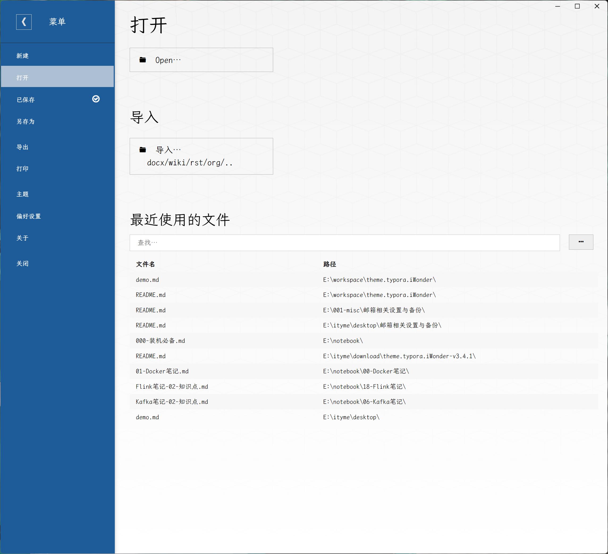

# iWonder Typora Theme

> 一个我想要的Typora主题.
>
> 一个以让文档重点更醒目为原则设计的主题.

> A Typora theme I wanted.
>
> A theme designed to sharpen the focus of the document.

## 特性 | Feature

> 1. 主题配色方案让重点更突出醒目, 详见下方预览.
> 2. 提供更简化的标签快捷键, 配合自定义的标签颜色, 一键高亮选中文本.
> 3. 提供特殊语义标签, 让页面展现出更多花样.
> 4. iWonder主题仅在Windows系统下做过测试, 无法确定Linux和Mac下效果.
> 5. iWonder主题持续更新中, 有新需求欢迎留言.

> 1. The theme color scheme makes the key points more prominent and eye-catching, as shown in the preview.
> 2. Provide simplified label shortcuts, combined with custom label colors, to modify the selected text color with just one click.
> 3. Provide special semantic tags to display more styles on the page.
> 4. The iWonder theme has only been tested on Windows systems and cannot determine its effectiveness on Linux and Mac.
> 5. The iWonder theme is constantly being updated.

## 安装 | Install

>> **一键安装✨**
>
>> 1. [点击此处下载.](https://github.com/ityme/theme.typora.iWonder/releases/latest)
>> 2. 解压安装包, 然后双击运行安装包中的`install.bat`脚本.
>> 3. 重启Typora后, 切换主题(主题名格式：`IWxxxx`).
>
>> **手动安装**
>>
>> 1. [点击此处下载.](https://github.com/ityme/theme.typora.iWonder/releases/latest)
>> 2. 解压安装包, 将安装包中所有内容粘贴到主题目录.主题目录可通过`Typora > 菜单 > 主题 > 打开主题文件夹`打开.
>> 3. 重启Typora后, 切换主题(主题名格式：`IWxxxx`).
>

> >**Quick Install✨**
> >
> >1. [DownLoad.](https://github.com/ityme/theme.typora.iWonder/releases/latest)
> >2. Unzip the installation package, and double-click to run the `install.bat` script in the installation package.
> >3. Restart Typora and switch theme. (theme name format：`IWxxxx`).
>
> > **Step by step Install**
> >
> > 1. [DownLoad.](https://github.com/ityme/theme.typora.iWonder/releases/latest)
> > 2. Unzip and paste everything in the installation package into the theme folder. The theme folder can be opened from`Typora > menu> themes > open themes folder`.
> > 3. Restart Typora and switch theme. (theme name format：`IWxxxx`).

## 快捷键 | ShortcutKeys

| Function   | 功能       | 快捷键         |
| ---------- | ---------- | -------------- |
| Find       | 查找       | `Ctrl+F`       |
| Replace    | 替换       | `Ctrl+R`       |
| Strong     | 加粗       | `Ctrl+B`       |
| Emphasis   | 斜体       | `Ctrl+I`       |
| Strike     | 删除线     | `Ctrl+D`       |
| Underline  | 下划线     | `Ctrl+U`       |
| Highlight  | 高亮       | `Ctrl+H`       |
| Hyperlink  | 超链接     | `Ctrl+L`       |
| Code       | 代码块     | `Ctrl+K`       |
| CodeFences | 多行代码块 | `Ctrl+Shift+K` |
| Image      | 图片       | `Ctrl+Shift+I` |

## 语义标签 | SemanticTags

> [!Tip]
>
> 部分文本中, 通过后缀特殊语义标签, 可对样式进行调整, 以使排版更美观

| 语义标签 | 适用范围         | 作用                                                         | 示例                              |
| -------- | ---------------- | ------------------------------------------------------------ | --------------------------------- |
| `<i>`    | `h1`             | 在`h1`中后缀不同数量`<i>`控制不同的页面背景图展示模式 | `# title`:轮播 `#title <i>`:固定背景图 `#title <i><i>`: 无图 |
| `<fit>`  | `h2 h3 h4 h5 h6` | 标题默认背景色填充整行, 标题中后缀本标签后, 背景色不再填充整行, 而是由内容撑开 | `## title`: 背景色填充整行 |

## 订制 | DIY

> 通过修改特定的的配置项, 可以任意修改本主题的字体和颜色和背景图样式.
>
> 进阶：定制多个主题并存.
>
> 示例：假设, 我想要修改一套红色, 宋体字体, 自定义背景图的主题, 那么我可以：
>
> 1. 复制`iWonder > color-scheme > cyan.css`并将之重命名为`red.css`, 修改其中的颜色为红色系列.
>
> 2. 复制`iWonder > font-scheme > elegant.css`并将之重命名为`song.css`, 修改其中的字体为宋体.
>
> 3. 修改`iWonder > image-scheme > carousel.css`中背景相关参数.
>
> 4. 替换`iWonder > image-scheme > image`中背景图.
>
> 5. 修改`iWonder > image-scheme > map > map.css`中背景图路径与变量名的对照关系.
>
> 6. 复制`i-w-cyan.css`并将之重命名为`i-w-red.css`,
>
>    修改其中`@import url("iWonder/color-scheme/cyan.css");`文本为`@import url("iWonder/color-scheme/red.css")`,
>
>    修改其中`@import url("iWonder/font-scheme/elegant.css");`文本为`@import url("iWonder/font-scheme/song.css")`.
>
> 7. Typora中切换名为`IWRed`的主题.

> You can modify the font, color and background images style of this theme arbitrarily by modifying the configuration items.
>
> Advanced: customize the coexistence of multiple themes.
>
> Example: suppose I want to change the theme of a set of red, song font and customize background images, then I can:
>
> 1. Copy `red > color-scheme > cyan.css` and rename it to `red.css`, and change the color to red series.
>
> 2. Copy `iWonder > font-scheme > elegant.css` and rename it `song.css`, and change the font to Song font.
>
> 3. Modify `iWonder > image-scheme > carousel.css`.
>
> 4. Replace the background images in `iWonder > image-scheme > image`.
>
> 5. Modify the mapping (or correspondence) between background image paths and variable names in `iWonder > image-scheme > map > map.css`.
>
> 6. Copy `i-w-cyan.css` and rename it `i-w-red.css`.
>
>    Modify `@import url("iWonder/color-scheme/cyan.css");` text to `@import url("iWonder/color-scheme/red.css")`.
>
>    Modify `@import url("iWonder/font-scheme/elegant.css");` text to `@import url("iWonder/font-scheme/song.css")`.
>
> 7. Switch the Typora theme named `IWRed`.

## 预览 | Preview

### 封面主图

 

### 窄屏模式

  

### 宽屏模式

  

### 设置界面
 
